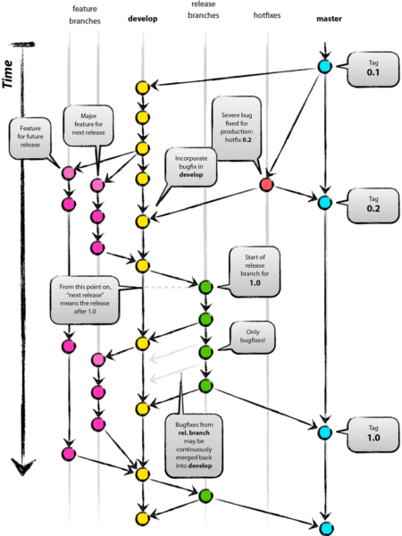

# Home Storage Management

# Git Flow

The flow adopted for git is [Git Flow](http://nvie.com/posts/a-successful-git-branching-model/).

The process can be done manually with the same Git commands, 
by IDE (IntelliJ: [Git Flow Integration](https://plugins.jetbrains.com/plugin/7315-git-flow-integration))
or by plugin [git-flow](https://github.com/nvie/gitflow/wiki). Either method can be used to use the stream.

Here is a comparison of the commands used in git-flow with the git commands:

**Note: The commands that make changes in the "develop" or "master" branch are not possible to use, since these
  branch are protected, so in these cases you need to open a "Merge Request" for the respective branch.**

## Initialize

gitflow | git
--------|-----
`git flow init` | `git init`
&nbsp; | `git commit --allow-empty -m "Initial commit"`
&nbsp; | `git checkout -b develop master`

Use default name branch

>  Branch name for production releases: [master]  
Branch name for "next release" development: [develop]  
Feature branches? [feature/]  
Release branches? [release/]  
Hotfix branches? [hotfix/]  
Support branches? [support/]  
Version tag prefix? []  

## Connect to the remote repository

gitflow | git
--------|-----
_N/A_ | `git remote add origin git@github.com:MYACCOUNT/MYREPO`

## Features

### Create a feature branch

gitflow | git
--------|-----
`git flow feature start MYFEATURE` | `git checkout -b feature/MYFEATURE develop`

### Share a feature branch

gitflow | git
--------|-----
`git flow feature publish MYFEATURE` | `git checkout feature/MYFEATURE`
&nbsp; | `git push origin feature/MYFEATURE`

### Get latest for a feature branch

gitflow | git
--------|-----
`git flow feature pull origin MYFEATURE` | `git checkout feature/MYFEATURE`
&nbsp; | `git pull --rebase origin feature/MYFEATURE`

### Finalize a feature branch

gitflow | git
--------|-----
`git flow feature finish MYFEATURE` | `git checkout develop`
&nbsp; | `git merge --no-ff feature/MYFEATURE`
&nbsp; | `git branch -d feature/MYFEATURE`

### Push the merged feature branch

gitflow | git
--------|-----
_N/A_ | `git push origin develop`
&nbsp; | `git push origin :feature/MYFEATURE` _(if pushed)_

## Releases 

### Create a release branch

gitflow | git
--------|-----
`git flow release start 1.2.0` | `git checkout -b release/1.2.0 develop`

### Share a release branch

gitflow | git
--------|-----
`git flow release publish 1.2.0` | `git checkout release/1.2.0`
&nbsp; | `git push origin release/1.2.0`

### Get latest for a release branch

gitflow | git
--------|-----
_N/A_ | `git checkout release/1.2.0`
&nbsp; | `git pull --rebase origin release/1.2.0`

### Finalize a release branch

gitflow | git
--------|-----
`git flow release finish 1.2.0` | `git checkout master`
&nbsp; | `git merge --no-ff release/1.2.0`
&nbsp; | `git tag -a 1.2.0`
&nbsp; | `git checkout develop`
&nbsp; | `git merge --no-ff release/1.2.0`
&nbsp; | `git branch -d release/1.2.0`

### Push the merged feature branch

gitflow | git
--------|-----
_N/A_ | `git push origin master`
&nbsp; | `git push origin develop`
&nbsp; | `git push origin --tags`
&nbsp; | `git push origin :release/1.2.0` _(if pushed)_

## Hotfixes

### Create a hotfix branch

gitflow | git
--------|-----
`git flow hotfix start 1.2.1 [commit]` | `git checkout -b hotfix/1.2.1 [commit]`

### Finalize a hotfix branch

gitflow | git
--------|-----
`git flow hotfix finish 1.2.1` | `git checkout master`
&nbsp; | `git merge --no-ff hotfix/1.2.1`
&nbsp; | `git tag -a 1.2.1`
&nbsp; | `git checkout develop`
&nbsp; | `git merge --no-ff hotfix/1.2.1`
&nbsp; | `git branch -d hotfix/1.2.1`

### Push the merged hotfix branch

gitflow | git
--------|-----
_N/A_ | `git push origin master`
&nbsp; | `git push origin develop`
&nbsp; | `git push origin --tags`
&nbsp; | `git push origin :hotfix/1.2.1` _(if pushed)_
  

## References

 - http://nvie.com/posts/a-successful-git-branching-model/
 - https://help.github.com/articles/using-pull-requests#shared-repository-model
 - https://fjorgemota.com/git-flow-uma-forma-legal-de-organizar-repositorios-git/